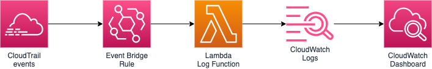

# Detect Console Activities

This is a demonstration repository that contains a simple CloudFormation template
to collect and display CloudTrail events performed manually via the AWS Console.

## Architecture



## Usage

Deploy the CloudFormation `template.yaml` either via console or CLI.
The `Makefile` contains a target to quickly `deploy` the solution.

### Deploy via make

```bash
$ make deploy
```